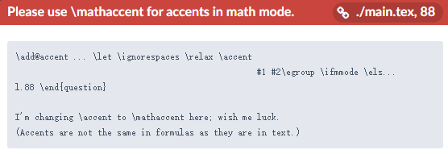
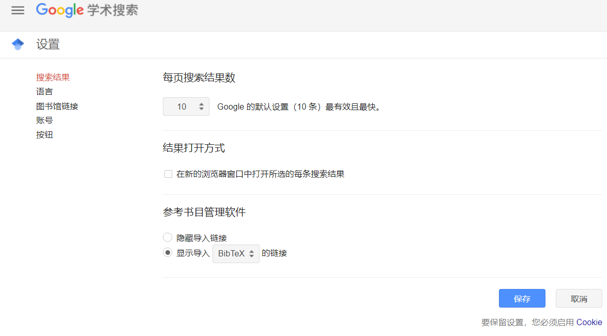

# Latex-Note
### 1.论文引用
首先需要创建一个.bib文件用以存放引用的bibtex，这里比如我们创建一个名为refer.bib的文件

在文章末尾添加(\end{document}之前)
```
\bibliographystyle{IEEEtran} %ieeetrans的引用格式
\bibliography{refer} % refer就是之前建立的refer.bib文件的前缀
```
如果用的是Springer投稿模板LLCNS首先需要把splncs04.bst放入根目录下，然后使用
```
\bibliographystyle{splncs04}
```
接下来需要在bib文件里添加我们引用的文章

我们需要在google scholar上复制bibtex并添加到文件中(截图来自步骤记录器，鼠标来自澄闪)


接下来在文中使用\cite{}就可以对需要的论文进行引用

比如这篇文章的bibtex
```
@inproceedings{zhang2022experimental,
  title={An Experimental Study of Digital Communication System with Human Body as Communication Channel},
  author={Zhang, Chengyi and Jin, Qingyun and Zhao, Mohan and Zhang, Dingguo and Lin, Lin},
  booktitle={2022 IEEE-EMBS International Conference on Wearable and Implantable Body Sensor Networks (BSN)},
  pages={1--4},
  year={2022},
  organization={IEEE}
}
```
在文中引用就写成
```
\cite{zhang2022experimental}
```
### 2.如何添加小信封标识
如果投递paper时用到了Springer投稿模板LLCNS，我们可能需要用到小信封标识来指明留下的作者的邮箱是哪位作者的

这里要先添加宏包
```
\usepackage[misc]{ifsym}
```
然后使用
```
\textsuperscript{\Letter}
```
即可出现小信封标识

Example:
```
\author{Lin Lin\inst{1}\textsuperscript{(\Letter)} 
```
其效果如图所示


### 3.如何添加高亮显示
在文章头部添加
```
\usepackage{soul}
\usepackage{color}
```
正常文本使用\hl{}指令就可以进行添加高亮

Example:
```
\hl{It is possible for us }to use nanomachine
```
其效果如图所示


而对于\cite{}指令则需要在文章宏包添加之后声明
```
\soulregister\cite7
```
便可以在引用处使用\hl{}指令实现高亮，否则会发生报错

Example:
```
in the tissue and venous blood \hl{\cite{luo2006}}.
```
其效果如图所示


### 4.Reply琐记
今天在写Reply的时候发现了这样一件事，由于Reply中的引用一般以\emph实现，而论文中的引用上面已经提到了用bibtex实现

Reply中我们一般是这么写的
```
 [1]  \emph{N. Farsad, H. B. Yilmaz, A. Eckford, C.-B. Chae, and W. Guo, “A comprehensive survey of recent advancements in molecular communication,” IEEE Commun. Surv. Tutor., vol. 18, no. 3, pp. 1887–1919, 2016.}
```
然后正文中直接使用[1],[2]等标记表示引用

结果遇到了这样一篇文献


作者貌似是西班牙人，名字上带音标，所以我在Reply中引用时候考虑用公式$\'a$和$\'A$来实现字母顶音标的情况

也就是
```
[1]  \emph{J. Li, B. Esteban-Fern$\'a$ndez de $\'A$vila, W. Gao, L. Zhang, and J. Wang, “Micro/nanorobots for biomedicine: Delivery, surgery, sensing, and detoxification,” Science robotics, vol. 2, no. 4, p.eaam6431, 2017.}
```
没想到报错了



其实这里直接text表示而非采用数学公式表示就可以直接解决这个问题，即
```
[1]  \emph{J. Li, B. Esteban-Fern{\'a}ndez de {\'A}vila, W. Gao, L. Zhang, and J. Wang, “Micro/nanorobots for biomedicine: Delivery, surgery, sensing, and detoxification,” Science robotics, vol. 2, no. 4, p.eaam6431, 2017.}
```


### 5.没啥用的小技巧
Google Scholar在设置里可以设置快捷引用，如下图所示，这样就可以直达需要引用的格式了


